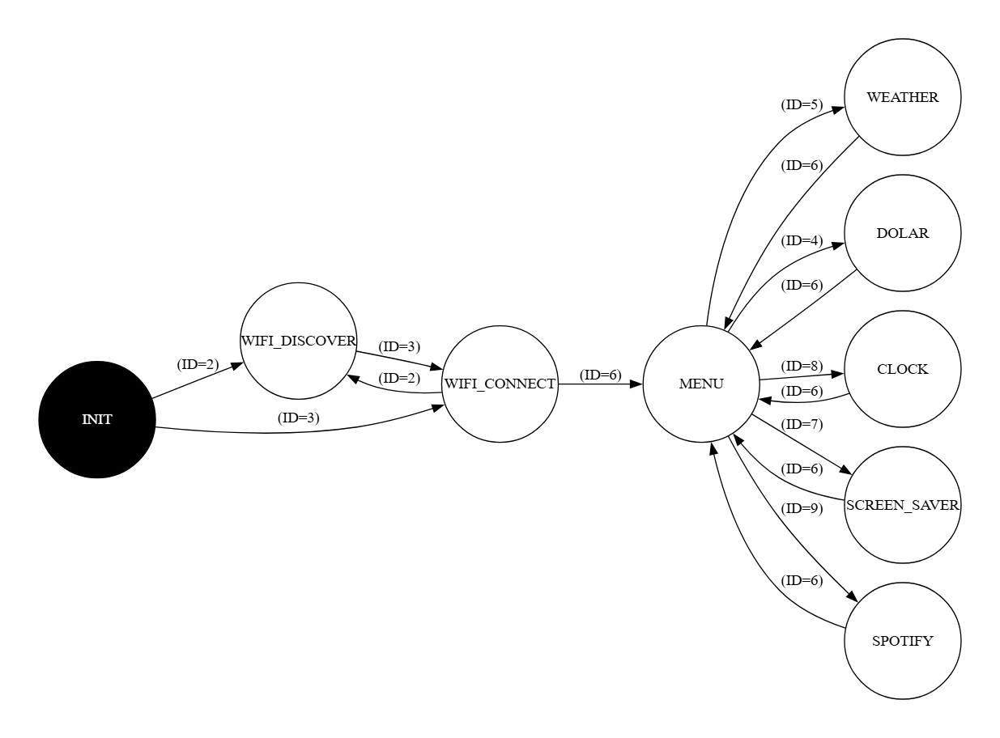

# The Box

Small project to create a desktop accessory that can display the current time, date, and weather

# TODO

- [x] Improve the UI
- [X] Try to integrate with Spotify API
- [X] Check if there is a way to optimize the execution time
- [ ] Document circuit
- [ ] Make a 3d printed case
- [ ] Add a power saver mode / sleep mode
- [ ] Add a way to display de album cover of the current song asynchronusly
- [ ] Solve the bug that makes the last part of the display to be cut off

